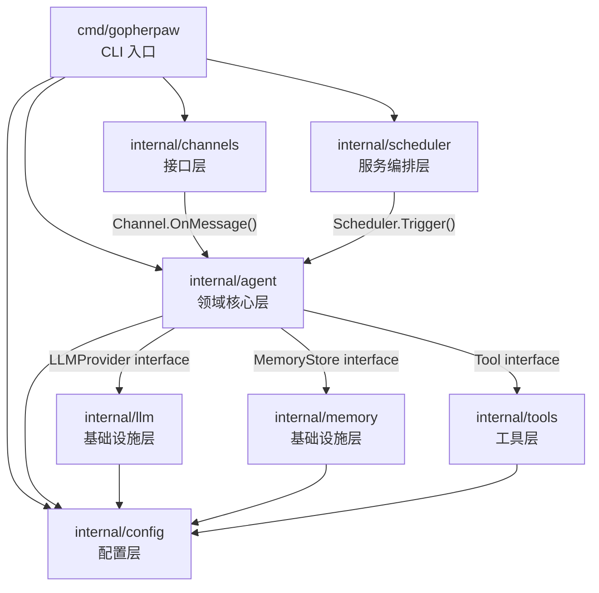
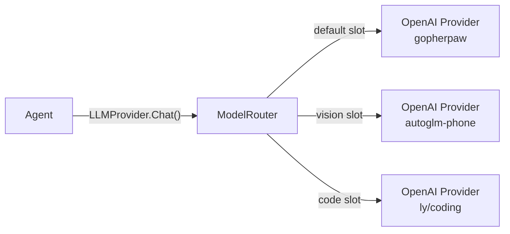

# GopherPaw Architecture Specification

> 契约文档：系统架构的唯一真理来源。所有架构变更必须先更新此文档。

## 功能全景

完整 CoPaw vs GopherPaw 功能对标见 [docs/feature_matrix.md](feature_matrix.md)，包含 12 大模块、83 项功能的实现状态与优先级建议。

## 系统总览

GopherPaw 是 CoPaw 的 Go 语言复刻版，采用四层解耦架构。



## 层级定义

### 入口层 (cmd/)

| 包 | 职责 |
|---|------|
| `cmd/gopherpaw/` | CLI 启动、依赖组装（wire up）、信号处理 |

职能红线：仅做依赖组装和启动，不含业务逻辑。

### 接口层 (internal/channels/)

| 包 | 职责 |
|---|------|
| `internal/channels/` | 消息渠道框架：Channel 接口、Manager、各渠道同包实现（console/telegram/discord/dingtalk/feishu/qq）+ webhook_server |

职能红线：仅负责消息收发和格式转换，不含 Agent 逻辑。通过 `Agent` 接口调用核心层。

### 领域核心层 (internal/agent/)

| 包 | 职责 |
|---|------|
| `internal/agent/` | Agent 运行时、ReAct 循环、工具调度、会话管理、技能管理、Hook 系统、消息工具函数 |

核心文件：

| 文件 | 职责 |
|------|------|
| `agent.go` | ReactAgent 主循环、ReAct 推理 |
| `types.go` | 核心接口定义（Agent/LLMProvider/MemoryStore/Tool 等） |
| `commands.go` | 魔法命令处理（/compact, /new, /clear, /history, /await_summary, /daemon, /switch-model） |
| `hooks.go` | 生命周期钩子（MemoryCompactionHook, BootstrapHook） |
| `utils.go` | 消息工具函数（SanitizeToolMessages, CheckValidMessages, TokenCounting） |
| `prompt_loader.go` | 六文件提示词系统（PromptConfig, CopyMDFiles, BuildBootstrapGuidance） |
| `bootstrap.go` | 首次启动引导流程 |
| `session.go` | 会话管理 |
| `placeholder.go` | 占位符替换 |
| `planner.go` | TaskPlanner 任务规划器（v0.3.0 新增） |
| `executor.go` | Executor 执行器（v0.3.0 新增） |
| `context_manager.go` | ContextManager 上下文管理器（v0.3.0 新增） |
| `capability_extractor.go` | CapabilityExtractor 能力提取器（v0.3.0 新增） |
| `skill_hook.go` | SkillHook Skill 钩子（v0.3.0 新增） |
| `capability_registry.go` | 能力注册表缓存（v0.3.0 新增） |
| `cache_file.go` | 文件持久化缓存（v0.3.0 新增） |

职能红线：不直接 import 具体的 LLM/Memory/Channel 实现，仅依赖接口。这是系统的灵魂。

### 服务编排层 (internal/scheduler/)

| 包 | 职责 |
|---|------|
| `internal/scheduler/` | 定时任务、心跳、Cron 调度 |

职能红线：负责任务调度编排，通过 Agent 接口触发执行。

### 基础设施层

| 包 | 职责 |
|---|------|
| `internal/llm/` | LLM Provider 注册、请求转发、响应解析、多模型路由、消息格式化（Formatter） |
| `internal/memory/` | 短期/长期记忆存储、检索、压缩 |
| `internal/config/` | 配置加载、验证、热更新、工作目录 |
| `internal/skills/` | Skills 加载、启用/禁用、CRUD、Hub 搜索安装、系统提示词注入 |
| `internal/app/` | 应用生命周期管理（Start/Stop/RestartServices/HealthCheck），与 Scheduler 集成 |
| `internal/desktop/` | 远程桌面管理（VNC/noVNC 服务器、会话录制、控制切换），与 App 集成（规划中） |

职能红线：不含业务逻辑，仅做协议适配和数据存储。实现 Agent 层定义的接口。

#### ModelRouter（多模型路由）

`internal/llm/router.go` 实现 `agent.LLMProvider` 接口，内部管理多个模型槽位（ModelSlot），支持：

- **按能力自动路由**：检测消息中是否包含视觉内容（图片路径/base64），自动选择带 `vision` 能力的模型
- **手动切换**：通过 `Switch(slotName)` 方法或 `switch_model` 工具切换活跃模型
- **向后兼容**：未配置 `models` 时退化为单一 provider，行为不变



### 工具层 (internal/tools/)

| 包 | 职责 |
|---|------|
| `internal/tools/` | 内置工具实现：文件操作、Shell、搜索、时间、网络搜索、HTTP 请求、浏览器自动化、截屏、文件发送等 |

职能红线：每个工具独立，无跨工具耦合。实现 `Tool` 接口，多模态工具额外实现 `RichExecutor`。

| 工具 | 说明 | 依赖 |
|------|------|------|
| web_search | DuckDuckGo 网络搜索（无需 API Key） | github.com/kuhahalong/ddgsearch |
| http_request | 通用 HTTP GET/POST 请求 | 标准库 net/http |
| edit_file | 查找替换文件内容（对齐 CoPaw） | 标准库 |
| append_file | 在文件末尾追加内容（对齐 CoPaw） | 标准库 |
| browser_use | 浏览器自动化（CDP 协议，对齐 CoPaw Playwright） | github.com/go-rod/rod |
| desktop_screenshot | 跨平台桌面截屏 | github.com/kbinani/screenshot |
| send_file_to_user | 发送本地文件给用户（多模态 RichExecutor） | 标准库 mime |

## 依赖规则

```
合法依赖方向（箭头表示 "可以 import"）：
  cmd/ --> 所有 internal/ 包
  channels/ --> agent/ (仅接口)
  agent/ --> config/
  agent/ --(接口)--> llm/, memory/, tools/
  scheduler/ --> agent/ (仅接口), config/
  llm/, memory/, tools/ --> config/

禁止：
  llm/ -x-> agent/     (基础设施不得反向依赖领域)
  memory/ -x-> agent/   (基础设施不得反向依赖领域)
  tools/ -x-> channels/ (工具不得依赖接口层)
  任何循环依赖
```

## CoPaw 模块映射

| CoPaw Python | GopherPaw Go | 状态 |
|--------------|-------------|------|
| `agents/react_agent.py` | `internal/agent/agent.go` | 已实现 |
| `app/runner/runner.py` | `internal/agent/` + cmd/channels 装配与调用 | 已实现 |
| `app/runner/session.py` | `internal/agent/session.go`（SessionManager）+ memory 持久化 | 已实现 |
| `agents/command_handler.py` | `internal/agent/commands.go` | 已实现 |
| `providers/` | `internal/llm/` | 已实现 |
| `providers/openai_chat_model_compat.py` | `internal/llm/openai.go` | 已实现 |
| `agents/tools/*` | `internal/tools/` | 已实现 |
| (Skills: Tavily 等) | `internal/tools/web_search.go` | 已实现（DuckDuckGo 替代） |
| (Skills: HTTP) | `internal/tools/http_tool.go` | 已实现 |
| `agents/memory/` | `internal/memory/` | 已实现 |
| `app/channels/base.py` | `internal/channels/channel.go` | 已实现 |
| `app/channels/manager.py` | `internal/channels/manager.go` | 已实现 |
| `app/channels/registry.py` | Manager.buildChannels + config | 已实现 |
| `app/channels/console/` | `internal/channels/console.go` | 已实现 |
| `app/channels/telegram/` | `internal/channels/telegram.go` | 已实现 |
| `app/channels/discord_/` | `internal/channels/discord.go` | 已实现 |
| `app/channels/dingtalk/` | `internal/channels/dingtalk.go` + webhook_server | 已实现 |
| `app/channels/feishu/` | `internal/channels/feishu.go` + webhook_server | 已实现 |
| `app/channels/qq/` | `internal/channels/qq.go` + webhook_server | 已实现 |
| `app/channels/imessage/` | - | ⏭️ 跳过（macOS 专用） |
| `app/channels/voice/` | - | ⏭️ 跳过（Twilio） |
| `app/crons/manager.py` | `internal/scheduler/scheduler.go` + `heartbeat.go` | 已实现（心跳+调度启停；无 job repo/CRUD） |
| `app/crons/heartbeat.py` | `internal/scheduler/heartbeat.go` | 已实现 |
| `app/crons/executor.py` | 仅心跳等价于 agent 任务，无通用 CronExecutor | 部分 |
| `app/crons/models.py` | config.HeartbeatConfig，无 CronJobSpec 持久化 | 部分 |
| `app/crons/repo/` | 无 | 未实现 |
| `config/config.py` | `internal/config/config.go` | 已实现 |
| `providers/registry.py` | `internal/llm/registry.go` | 已实现 |
| `providers/openai_chat_model_compat.py` | `internal/llm/openai.go` | 已实现 |
| `providers/ollama_manager.py` | `internal/llm/ollama.go` | 已实现（HTTP API，无 Python SDK） |
| `providers/store.py` | 配置在 config.yaml llm + 可选 providers.json | 部分：无持久化 providers 文件，用 config + ModelRouter |
| `providers/models.py` | `internal/config` LLMConfig/ModelSlot | 已实现（语义在 config） |
| `local_models/manager.py` | `internal/llm/downloader.go` | 部分：仅 URL 下载，无 HF/ModelScope 清单 |
| `local_models/schema.py` | 无独立 schema，downloader 用 source 常量 | 部分 |
| `local_models/chat_model.py`、`backends/*` | 未实现 | 本地 llamacpp/mlx 推理未复刻 |
| `cli/main.py` | `cmd/gopherpaw/main.go` + `root.go` | 已实现 |
| `cli/app_cmd.py` | `cmd/gopherpaw/app.go` | 已实现（app 子命令，无 --reload/--workers） |
| `cli/channels_cmd.py` | `cmd/gopherpaw/channels_cmd.go` | 已实现（list/config；无 install/add/remove 交互） |
| `cli/chats_cmd.py` | `cmd/gopherpaw/chats.go` | 已实现（list/get/delete；无 HTTP API 调用，为提示） |
| `cli/clean_cmd.py` | `cmd/gopherpaw/clean.go` | 已实现（清空 working dir；无 --dry-run） |
| `cli/cron_cmd.py` | `cmd/gopherpaw/cron.go` | 已实现（list/create/delete/pause/resume；无 HTTP API，为提示） |
| `cli/daemon_cmd.py` | `cmd/gopherpaw/daemon.go` | 已实现（status/version/logs；无 restart/reload-config 实现） |
| `cli/env_cmd.py` | `cmd/gopherpaw/env.go` | 已实现（list/set/delete + check/setup 扩展） |
| `cli/init_cmd.py` | `cmd/gopherpaw/init_cmd.go` | 已实现（引导编辑 config，无交互 wizard） |
| `cli/providers_cmd.py`（models_group） | `cmd/gopherpaw/models.go` | 已实现（list/set-llm；无 add/remove/download/ollama-* 等） |
| `cli/skills_cmd.py` | `cmd/gopherpaw/skills_cmd.go` | 已实现（list/config/import；无 enable/disable 子命令） |
| `cli/uninstall_cmd.py` | 无 | 未实现（Go 单二进制无安装器，无需 uninstall） |
| `app/_app.py` | `internal/app/` | 已实现（App生命周期管理：Start/Stop/RestartServices/HealthCheck） |
| `app/_app.py` | `internal/app/` | 已实现（App生命周期管理：Start/Stop/RestartServices/HealthCheck） |
| `agents/skills_manager.py` | `internal/skills/manager.go` | 已实现 |
| `agents/skills_hub.py` | `internal/skills/hub.go` | 已实现 |
| `agents/hooks/bootstrap.py` | `internal/agent/hooks.go` | 已实现 |
| `agents/hooks/memory_compaction.py` | `internal/agent/hooks.go` | 已实现 |
| `agents/utils/token_counting.py` | `internal/agent/utils.go` | 已实现 |
| `agents/utils/tool_message_utils.py` | `internal/agent/utils.go` | 已实现 |
| `agents/prompt.py` | `internal/agent/prompt_loader.go` | 已实现 |
| `agents/model_factory.py` | `internal/llm/formatter.go` | 已实现 |
| `agents/schema.py` | `internal/agent/types.go` | 已实现 |
| `agents/command_handler.py` | `internal/agent/commands.go` | 已实现 |
| `agents/md_files/` | `configs/md_files/` | 已复制 |
| `agents/skills/` | `configs/active_skills/` | 已复制 |
| `app/mcp/manager.py` | `internal/mcp/client.go`（MCPManager） | 已实现 |
| `app/mcp/watcher.py` | 无独立 watcher，配置热重载由 config 或主程序处理 | 部分 |
| `app/routers/mcp.py` | 无 MCP 专用 HTTP API，CLI/配置驱动 | 未实现 |

## internal/config 与 CoPaw config 对齐说明

CoPaw 配置来源：`config/config.py`（根结构 Config）+ `constant.py`（工作目录、心跳默认值等）。CoPaw 根 Config 仅包含：`channels`、`mcp`、`last_api`、`agents`、`last_dispatch`、`show_tool_details`；LLM/记忆/服务端等由环境变量或 API 另行管理。GopherPaw 采用**单文件统一配置**（YAML），便于单二进制部署。

### 已对齐项

| CoPaw (config.py / constant) | GopherPaw (internal/config) |
|------------------------------|-----------------------------|
| `ChannelConfig`（discord/dingtalk/feishu/qq/telegram/console） | `ChannelsConfig` 同名字段与 snake_case 键一致 |
| 各渠道 `enabled`、`bot_prefix`、`bot_token`/`client_id`/`app_id` 等 | 已实现，键名与 CoPaw 一致 |
| `MCPConfig.clients` / `MCPClientConfig` | `MCPConfig.Servers` / `MCPServerConfig`（命名 clients→servers，语义一致） |
| `transport`: stdio / streamable_http / sse | `Transport`: "stdio" / "streamable_http" / "sse" |
| `AgentsRunningConfig.max_iters`、`max_input_length` | `AgentConfig.Running.MaxTurns`、`Running.MaxInputLength` |
| `AgentsConfig.defaults.heartbeat` | `AgentConfig.Defaults.Heartbeat`（enabled/every/target/active_hours） |
| `AgentsConfig.language`、`installed_md_files_language` | `AgentConfig.Language`（installed_md_files_language 暂未实现） |
| `ActiveHoursConfig` (start/end) | `ActiveHours` (Start/End) |
| 工作目录（COPAW_WORKING_DIR → ~/.copaw） | `WorkingDir` + `ResolveWorkingDir()`，默认 ~/.gopherpaw |
| 密钥目录（COPAW_SECRET_DIR → ~/.copaw.secret） | `GetSecretDir()`，默认 ~/.gopherpaw.secret |
| envs.json 持久化（SECRET_DIR/envs.json） | `GetEnvsJSONPath()` + EnsureSecretDir() |
| providers.json 持久化（SECRET_DIR/providers.json） | `GetProvidersJSONPath()` + EnsureSecretDir() |
| 环境变量（COPAW_* → GOPHERPAW_*） | 21 个环境变量完整映射（见 api_spec.md 环境变量表） |
| 配置文件（COPAW_CONFIG_FILE） | `GetConfigFile()`，默认 config.yaml |
| 任务文件（COPAW_JOBS_FILE） | `GetJobsFile()`，默认 jobs.json |
| 聊天文件（COPAW_CHATS_FILE） | `GetChatsFile()`，默认 chats.json |
| 心跳文件（COPAW_HEARTBEAT_FILE） | `GetHeartbeatFile()`，默认 HEARTBEAT.md |
| 容器标识（COPAW_RUNNING_IN_CONTAINER） | `IsRunningInContainer()` |
| 启用渠道（COPAW_ENABLED_CHANNELS） | `GetEnabledChannels()` |
| CORS 源（COPAW_CORS_ORIGINS） | `GetCORSOrigins()` |
| Provider 超时（COPAW_MODEL_PROVIDER_CHECK_TIMEOUT） | `GetModelProviderCheckTimeout()` |
| 记忆压缩保留（COPAW_MEMORY_COMPACT_KEEP_RECENT） | 环境变量覆盖 `memory.compact_keep_recent` |
| 记忆压缩比例（COPAW_MEMORY_COMPACT_RATIO） | 环境变量覆盖 `memory.compact_ratio` |
| Skills 目录（ACTIVE_SKILLS_DIR / CUSTOMIZED_SKILLS_DIR） | `SkillsConfig.ActiveDir` / `CustomizedDir` |

### GopherPaw 扩展（CoPaw 不在 config 文件内）

- **server**：HTTP 服务 host/port（CoPaw 为 API 或 last_api）
- **llm**：provider/model/api_key/base_url/ollama_url/models（多模型槽位）
- **memory**：backend/db_path/max_history/compact_*/embedding_*/fts_enabled
- **log**：level/format
- **runtime**：python（venv_path/interpreter/auto_install）、node（runtime/bun_path/node_path/auto_install）
  - Bun 安装：优先使用官方安装脚本（curl -fsSL https://bun.sh/install | bash），而非直接下载二进制
  - 兼容性：支持 Windows/macOS/Linux，自动检测系统架构并下载对应版本

### 已知差异（不要求一致）

- **渠道**：CoPaw 有 `imessage`、`voice` 及 `filter_tool_messages`、`show_typing`、`media_dir` 等；GopherPaw 暂未实现 imessage/voice，未声明 filter_tool_messages/show_typing/media_dir。
- **配置格式**：CoPaw 使用 config.json + `load_config`/`save_config`；GopherPaw 使用 config.yaml + Viper 只读加载与 `LoadWithWatch` 热重载，无运行时写回。
- **心跳默认**：CoPaw `HEARTBEAT_DEFAULT_EVERY` 为 "6h"，GopherPaw 默认 "30m"。
- **MCP 键名**：CoPaw 为 `mcp.clients`，GopherPaw 为 `mcp.servers`（语义等价）。

## internal/llm 与 CoPaw providers/*、local_models/* 对齐说明

CoPaw 的 LLM 能力分布在 **providers**（远程/ Ollama 定义、注册、持久化、发现与测通）和 **local_models**（本地模型下载、清单、llamacpp/mlx 推理后端）。GopherPaw 用 `internal/llm` 统一实现「可调用的 LLM 接口」，配置来自主 config，无独立 providers.json 持久化。

### 已对齐项

| CoPaw | GopherPaw |
|-------|-----------|
| `providers/openai_chat_model_compat`：OpenAI 兼容 Chat/ChatStream | `internal/llm/openai.go`：OpenAIProvider，Chat/ChatStream，go-openai |
| `providers/ollama_manager`：Ollama 模型列表与拉取 | `internal/llm/ollama.go`：OllamaProvider 通过 HTTP /api/chat，配置用 llm.ollama_url |
| `providers/registry`：按名称取 ChatModel/Provider | `internal/llm/registry.go`：Register(name, Factory)、Create(cfg)、SwitchProvider(provider, model, baseCfg) |
| 多模型/多槽位（active_llm + 多 provider） | ModelRouter + config.llm.models（ModelSlot），Switch(slotName)、按 vision 能力路由 |
| `providers/models`：ResolvedModelConfig（model/base_url/api_key） | 由 config.LLMConfig + ModelSlot 在运行时解析，无单独 ResolvedModelConfig 类型 |
| 消息格式化（tool 结果中的 file block） | `internal/llm/formatter.go`：FileBlockSupportFormatter |
| 本地模型「下载」入口 | `internal/llm/downloader.go`：DownloadModel(ctx, repoID, source, backend)、DownloadFromURL(ctx, url)，落盘 ~/.gopherpaw/models/ |

### GopherPaw 与 CoPaw 差异（未复刻或简化）

- **providers.json**：CoPaw 有 load/save_providers_json、get_active_llm_config、set_active_llm、update_provider_settings；GopherPaw 无独立持久化文件，活跃模型由 config.yaml + 运行时 ModelRouter.Switch 决定，可选支持 `config.LoadProviders(path)` 读外部 JSON 仅用于组装。
- **自定义 Provider CRUD**：CoPaw 有 create_custom_provider、delete_custom_provider、add_model、remove_model；GopherPaw 无运行时 CRUD，通过 config 中 llm.models 声明槽位。
- **发现与测通**：CoPaw 有 discover_provider_models、test_provider_connection、test_model_connection；GopherPaw 未实现。
- **Ollama 列表/拉取**：CoPaw 通过 Python SDK ollama.list()/pull()；GopherPaw 仅用 HTTP 调用聊天接口，未实现 ListModels/PullModel API。
- **local_models 完整链路**：CoPaw 有 BackendType(llamacpp/mlx)、LocalModelInfo、manifest.json、LocalModelManager.download（HuggingFace/ModelScope）、list_local_models、get_local_model、delete_local_model、create_local_chat_model；GopherPaw 仅有 DownloadModel/DownloadFromURL（URL 下载），无 manifest、无 llamacpp/mlx 推理后端、无 list/delete/local_chat_model。

### 契约与实现约定

- **LLM 调用面**：以 `agent.LLMProvider`（Chat/ChatStream/Name）为唯一调用契约；所有 provider 与 ModelRouter 均实现该接口。
- **配置来源**：主配置为 `config.LLMConfig`（含 Models map）；若需与 CoPaw 的 providers.json 互操作，可使用 `config.LoadProviders(path)` 读入后合并到内存配置，不写回文件。

## internal/memory 与 CoPaw agents/memory 对齐说明

CoPaw 记忆能力在 **agents/memory**：`MemoryManager`（继承 ReMeCopaw，负责压缩与摘要）、`AgentMdManager`（working_dir / memory 目录下 md 的读写与列表）。GopherPaw 用 `internal/memory` 实现 `agent.MemoryStore`，统一短期/长期/检索/压缩。

### 已对齐项

| CoPaw agents/memory | GopherPaw internal/memory |
|---------------------|---------------------------|
| MemoryManager.compact_memory(messages, previous_summary) | MemoryStore.Compact(chatID)、GetCompactSummary(chatID)；Compactor 使用 LLM 生成摘要 |
| MemoryManager.summary_memory(messages) | 压缩摘要写入 summary，SaveLongTerm 可持久化到长期记忆 |
| 短期对话历史（ReMe 上下文） | Save/Load（InMemoryStore 或 FullMemoryStore 短期层），max_history 限制 |
| 长期记忆（memory 目录 + MEMORY.md） | FileStore：MEMORY.md + memory/YYYY-MM-DD.md，SaveLongTerm(category=memory/log)、LoadLongTerm |
| AgentMdManager 的 memory 目录 list/read/write | LoadLongTerm 聚合 MEMORY.md 与 memory/*.md；SaveLongTerm 按 category 追加；无独立 list_memory_mds API（内部按目录读） |
| 语义检索（向量 + 全文） | Search：HybridSearcher 向量×0.7 + BM25×0.3，candidate_multiplier=3 |
| 配置参数（max_input_length, memory_compact_ratio, vector_weight 等） | CompactConfig（Threshold/KeepRecent/Ratio）、MemoryConfig（compact_*、embedding_*）、hybrid 权重与候选数 |
| 文件监控（ReMe 侧如有） | watcher.go：fsnotify 监控 memory 目录变动，异步更新索引 |
| Embedding | embedding.go：OpenAI 兼容 API，LRU 缓存 |

### 差异与说明

- **Working 目录 md**：CoPaw AgentMdManager 的 list_working_mds/read_working_md/write_working_md 针对「工作目录根下 *.md」（如六文件提示词）；GopherPaw 由 `internal/agent` 的 PromptLoader 管理六文件，不放在 memory 包内，语义一致、归属不同包。
- **存储布局**：CoPaw 使用 ReMe 的 working_dir + memory 子目录；GopherPaw 使用 working_dir/data/chats/{chatID}/ 下 history JSON、MEMORY.md、memory/YYYY-MM-DD.md，按 chatID 隔离。
- **tool_result_threshold / retention_days**：CoPaw ReMe 有工具结果压缩与保留天数；GopherPaw 未单独暴露这两项，工具结果随消息历史保存与压缩。
- **依赖**：CoPaw MemoryManager 依赖 ReMe（reme_copaw）；GopherPaw 自实现 FullMemoryStore + FileStore + Compactor + HybridSearcher，无 ReMe 依赖。

### 契约与实现约定

- **调用面**：以 `agent.MemoryStore`（Save/Load/Search/Compact/GetCompactSummary/SaveLongTerm/LoadLongTerm）为唯一契约；backend=memory 时用 InMemoryStore，backend 为 full/sqlite 等时用 FullMemoryStore。
- **长期记忆路径**：MEMORY.md 与 memory/YYYY-MM-DD.md 与 CoPaw 的 MEMORY.md、memory/*.md 语义一致，便于迁移与对照。

## internal/tools 与 CoPaw agents/tools 全量对齐说明

CoPaw 内置工具在 **agents/tools**：file_io、file_search、shell、get_current_time、memory_search、send_file、browser_control、desktop_screenshot，另从 agentscope 引入 view_text_file、write_text_file、execute_python_code。GopherPaw `internal/tools` 通过 `RegisterBuiltin()` 注册全部内置工具，实现 `agent.Tool`，多模态工具另实现 `RichExecutor`。

### 已对齐工具（与 CoPaw 一一对应）

| CoPaw agents/tools | GopherPaw internal/tools | 说明 |
|--------------------|--------------------------|------|
| `get_current_time` | TimeTool | 当前系统时间与时区 |
| `execute_shell_command` | ShellTool | Shell 命令执行，cwd/timeout |
| `read_file` | ReadFileTool | 支持 start_line/end_line，相对路径基于 working_dir |
| `write_file` | WriteFileTool | 创建/覆盖 |
| `edit_file` | EditFileTool | 查找替换（old_text → new_text） |
| `append_file` | AppendFileTool | 末尾追加 |
| `grep_search` | GrepSearchTool | 按模式搜索，pattern/path/is_regex/case_sensitive |
| `glob_search` | GlobSearchTool | glob 匹配文件列表 |
| `create_memory_search_tool` | MemorySearchTool | 语义搜索记忆（混合检索），依赖 context MemoryStore |
| `send_file_to_user` | SendFileTool | 发送本地文件给用户；RichExecutor 返回 Attachment，经 FileSender 投递渠道 |
| `browser_use` | BrowserTool | 浏览器自动化：start/stop/open/screenshot/click/type/hover/eval/snapshot/pdf/tabs/wait_for/resize 等（CoPaw 为 Playwright，GopherPaw 为 go-rod CDP） |
| `desktop_screenshot` | ScreenshotTool | 跨平台桌面截屏；RichExecutor 返回截图附件（CoPaw 为 mss/screencapture，GopherPaw 为 kbinani/screenshot） |

### GopherPaw 扩展（CoPaw 非 agents/tools 或为 Skills）

| 工具 | 实现 | 说明 |
|------|------|------|
| `web_search` | WebSearchTool | 网络搜索（CoPaw 为 Tavily 等 Skills，GopherPaw 用 DuckDuckGo 内置） |
| `http_request` | HTTPTool | 通用 HTTP 请求（CoPaw 为 Skills，GopherPaw 内置） |
| `switch_model` | ModelSwitchTool | 切换 ModelRouter 活跃槽位（CoPaw 为 daemon/API） |

### 差异与未复刻

- **execute_python_code**：CoPaw 从 agentscope 引入；Go 版不提供执行 Python 代码，可视为跳过或由 Skills/MCP 替代。
- **view_text_file / write_text_file**：CoPaw 为 agentscope 工具名，与 read_file/write_file 语义一致；GopherPaw 仅提供 read_file/write_file。
- **browser_use 动作子集**：CoPaw browser_control 支持较多动作（如 navigate_back、console_messages、handle_dialog、file_upload、fill_form、install、press_key、network_requests、run_code、drag、select_option、evaluate 等）；GopherPaw BrowserTool 已覆盖常用 start/stop/open/screenshot/click/type/hover/eval/snapshot/pdf/tabs/wait_for/resize，其余可按需扩展。
- **desktop_screenshot**：CoPaw 在 macOS 上支持 capture_window（screencapture -w）；GopherPaw 当前为全屏截屏，未单独实现窗口选择。

### 契约与实现约定

- **工具面**：所有内置工具实现 `agent.Tool`（Name/Description/Parameters/Execute）；需向渠道投递文件时实现 `RichExecutor`（ExecuteRich → ToolResult + Attachments），由 Manager 通过 context FileSenderFunc 投递。
- **注册**：`tools.RegisterBuiltin()` 返回所有内置工具；CLI/主程序将返回值注入 Agent，可选合并 MCP 等外部工具。

## internal/agent 与 CoPaw agents/react_agent、runner、session、hooks、utils 对齐说明

CoPaw 的 Agent 能力分布在 **agents**（CoPawAgent/ReAct、hooks、utils、prompt、command_handler）和 **app/runner**（AgentRunner、session、command_dispatch）。GopherPaw 用 `internal/agent` 统一实现：ReAct 循环、会话、钩子、消息工具与魔法命令。

### 已对齐项

| CoPaw | GopherPaw |
|-------|-----------|
| **agents/react_agent.py** CoPawAgent(ReActAgent)：max_iters、max_input_length、memory_compact_threshold、toolkit、skills、system prompt、namesake_strategy | **agent.go** ReactAgent：MaxTurns、MaxInputLength、buildMessages 中应用 Compact 阈值与 hooks，tools/toolMap、skillsContent、loader.BuildSystemPrompt、NamesakeStrategy（默认 skip） |
| 魔法命令优先（command path）：_is_command → run_command_path | **agent.go** Run 入口：HandleMagicCommand 优先，再走 ReAct |
| **app/runner/runner.py** AgentRunner.query_handler：创建 CoPawAgent、load_session_state、stream 调用 agent、save_session_state | **cmd + channels**：主程序组装 ReactAgent；每条消息 Run/RunStream；会话状态由 memory（Save/Load）与 SessionManager（内存）承载，无 JSON 持久化 |
| **app/runner/session.py** SafeJSONSession：session_id/user_id 文件名消毒、save/load 会话状态 | **session.go** SessionManager：GetOrCreate(chatID)、Remove(chatID)；会话按 chatID 隔离，状态在 memory + 内存 Session，无 SafeJSONSession 式文件持久化 |
| **agents/hooks** BootstrapHook：首次用户消息时检查 BOOTSTRAP.md、prepend 引导、写 .bootstrap_completed | **hooks.go** BootstrapHook(workingDir, language)：检测 BOOTSTRAP.md、首次交互时在用户消息前添加引导内容、写 .bootstrap_completed；**已集成**：cmd/gopherpaw/app.go 中自动添加 |
| **agents/hooks** MemoryCompactionHook：pre_reasoning 检查 token 数、超阈值调用 memory_manager.compact_memory、保留近期消息 | **hooks.go** MemoryCompactionHook(threshold, keepRecent)：Hook 在 ReAct 每轮前执行，超阈值调用 memory.Compact，保留 keepRecent 条；**已集成**：cmd/gopherpaw/app.go 中根据 cfg.Memory.CompactThreshold 自动添加 |
| **agents/utils** token_counting：count_message_tokens、safe_count_message_tokens、safe_count_str_tokens | **utils.go** CountMessageTokens、SafeCountMessageTokens、CountStringTokens；**hooks.go** EstimateMessageTokens |
| **agents/utils** tool_message_utils：_sanitize_tool_messages、check_valid_messages、_repair_empty_tool_inputs、dedup 等 | **utils.go** SanitizeToolMessages、CheckValidMessages、RepairEmptyToolInputs、removeInvalidToolBlocks、dedupToolCalls、reorderToolResults、removeUnpairedToolMessages |
| **agents/utils** message_processing：is_first_user_interaction、prepend_to_message_content、process_file_and_media_blocks_in_message | **hooks.go** isFirstUserInteraction；**utils.go** BuildEnvContext；占位符/文件块处理在 buildMessages 或 Formatter 侧 |
| **agents/utils** setup_utils：copy_md_files | **prompt_loader.go** CopyMDFiles |
| **agents/command_handler**：/compact、/new、/clear、/history、/daemon、/switch-model 等 | **commands.go** HandleMagicCommand：/compact、/new、/clear、/history、/compact_str、/await_summary、/daemon、/switch-model |

### 差异与说明

- **会话持久化**：CoPaw 使用 SafeJSONSession 将 session state 写入 JSON 文件（save_dir，文件名由 session_id/user_id 消毒）；GopherPaw 无 runner 层 JSON session 文件，会话由 MemoryStore（历史 + 长期）与内存 SessionManager 组成，chat 状态在 memory 中持久化。
- **Runner 与 Agent 边界**：CoPaw 为 AgentRunner.query_handler 创建 CoPawAgent、load/save_session_state、stream 迭代；GopherPaw 由 channels 直接调用 Agent.Run/RunStream，无独立 Runner 类，等价逻辑分布在 main 装配与 agent.Run 内。
- **Hook 注册方式**：CoPaw 通过 AgentScope register_instance_hook("pre_reasoning", ...)；GopherPaw 在 ReAct 循环内显式调用 Hook(ctx, agent, chatID, messages)，不依赖框架钩子注册。
- **utils 范围**：CoPaw 含 file_handling（download_file_from_base64/from_url）；GopherPaw 未在 agent 包内实现下载工具函数，文件/媒体块可由渠道或 Formatter 处理。
- **env_context**：CoPaw 将 session_id/user_id/channel/working_dir 等注入 system prompt；GopherPaw 通过 context（ProgressReporter、DaemonInfo、FileSender）与 buildMessages 传递，无统一 env_context 字符串注入，可按需在 loader 或 cfg 中扩展。

### 契约与实现约定

- **调用面**：以 `agent.Agent`（Run、RunStream）为唯一入口；魔法命令在 Run 内优先处理；ReAct 循环内每轮前执行 Hooks（Bootstrap、MemoryCompaction），再 buildMessages、LLM.Chat、工具执行。
- **会话标识**：统一使用 chatID（由渠道传入）；SessionManager 仅内存，MemoryStore 负责持久化历史与长期记忆。

## internal/channels 与 CoPaw app/channels 各渠道对齐说明

CoPaw 渠道在 **app/channels**：BaseChannel、ChannelManager、registry（内置 + custom_channels 发现）、各渠道子包（console、telegram、discord_、dingtalk、feishu、qq、imessage、voice）。GopherPaw `internal/channels` 单包实现 Channel 接口、Manager 与六种内置渠道，无 imessage/voice。

### 已对齐项

| CoPaw app/channels | GopherPaw internal/channels |
|--------------------|----------------------------|
| **base.py** BaseChannel：process、on_reply_sent、send、消息消费 | **channel.go** Channel 接口：Start、Stop、Name、Send、IsEnabled；MessageHandler、IncomingMessage；可选 FileSender |
| **manager.py** ChannelManager：队列、消费、路由、last_dispatch | **manager.go** Manager：buildChannels、Start/Stop、handleMessage、lastDispatch、Channels() |
| **registry.py** get_channel_registry、BUILTIN 键 | Manager.buildChannels 按 config 启用；渠道名与 CoPaw 一致（console/telegram/discord/dingtalk/feishu/qq） |
| **console/** ConsoleChannel | **console.go** NewConsole，stdin/stdout，ProgressReporter |
| **telegram/** TelegramChannel | **telegram.go** NewTelegram，telebot 轮询，bot_prefix/bot_token/http_proxy |
| **discord_/** DiscordChannel | **discord.go** NewDiscord，discordgo，Message Content Intent |
| **dingtalk/** DingTalkChannel | **dingtalk.go** + **webhook_server.go**，session_webhook 发送、/webhook/dingtalk 接收 |
| **feishu/** FeishuChannel | **feishu.go** + **webhook_server.go**，tenant_access_token 发送、/webhook/feishu 接收 |
| **qq/** QQChannel | **qq.go** + **webhook_server.go**，access_token 发送、/webhook/qq 接收 |

### 差异与未复刻

- **imessage**：CoPaw 有 IMessageChannel（macOS）；GopherPaw 不实现，视为跳过。
- **voice**：CoPaw 有 VoiceChannel（Twilio）；GopherPaw 不实现，视为跳过。
- **自定义渠道**：CoPaw 从 CUSTOM_CHANNELS_DIR 动态加载 Python 类；GopherPaw 无动态加载，扩展需在 buildChannels 中显式注册。
- **队列与消费模型**：CoPaw 使用 asyncio 队列与 _process_batch/merge_native_items；GopherPaw 每渠道独立 goroutine，收到消息即调用 handleMessage（Agent.Run），无队列合并。
- **renderer/schema**：CoPaw 有 MessageRenderer、RenderStyle、ContentType；GopherPaw 无独立 renderer 包，发送为纯文本或 FileSender 投递附件。

### 契约与实现约定

- **调用面**：渠道通过 MessageHandler 将 IncomingMessage 交给 Manager；Manager 调用 Agent.Run(chatID, content)，用 lastDispatch 记录来源；心跳等投递使用 lastDispatch 或配置 target。
- **配置**：ChannelsConfig 与 config 对齐（console/telegram/discord/dingtalk/feishu/qq 各子配置 enabled、bot_prefix、token/client_id 等）。

## internal/scheduler 与 CoPaw app/crons 对齐说明

CoPaw 定时能力在 **app/crons**：CronManager（AsyncIOScheduler、repo、heartbeat 注册）、heartbeat（parse_heartbeat_every、run_heartbeat_once、active_hours）、executor（CronExecutor：text/agent 任务）、models（CronJobSpec、JobsFile）、repo（JSON 持久化）。GopherPaw `internal/scheduler` 提供 CronScheduler（robfig/cron）+ HeartbeatRunner（间隔执行、HEARTBEAT.md、投递到 last）。

### 已对齐项

| CoPaw app/crons | GopherPaw internal/scheduler |
|-----------------|------------------------------|
| **heartbeat.py** parse_heartbeat_every（30m、1h、2h30m 等） | **heartbeat.go** parseEveryToDuration、parseEveryToCron |
| **heartbeat.py** run_heartbeat_once：读 HEARTBEAT.md、跑 agent、按 target 投递 | **heartbeat.go** HeartbeatRunner.runOnce：LoadHEARTBEAT、Agent.Run、target=last 时 HeartbeatDispatcher.LastDispatch + Send |
| **heartbeat.py** _in_active_hours（start/end） | **heartbeat.go** inActiveHours（ActiveHours.Start/End） |
| **manager.py** 心跳作为 interval job 注册、reschedule_heartbeat | HeartbeatRunner 独立 goroutine 按 Every 间隔运行；无 reschedule（需重启或后续扩展） |
| **manager.py** CronManager start/stop、scheduler 启停 | **scheduler.go** CronScheduler Start/Stop；HeartbeatRunner Start/Stop |
| **manager.py** add_job（cron trigger） | **scheduler.go** AddJob(spec, job)，5 字段 cron |
| **config** heartbeat（enabled/every/target/active_hours） | **config** SchedulerConfig.Heartbeat，一致 |

### 差异与未复刻

- **Cron 任务持久化与 CRUD**：CoPaw 有 repo（BaseJobRepository、json_repo）、list_jobs、get_job、create_or_replace_job、delete_job、pause_job、resume_job、run_job；GopherPaw 无 jobs 文件、无 list/get/delete/pause/resume，仅 AddJob 注册内存中的 job。
- **CronExecutor**：CoPaw 执行 CronJobSpec（task_type text 发固定文案、task_type agent 调 runner.stream_query + send_event）；GopherPaw 仅有 HeartbeatRunner 这一种“定时跑 Agent”的固定逻辑，无通用 cron 任务类型（text/agent）与 dispatch 配置。
- **reschedule_heartbeat**：CoPaw ConfigWatcher 可调 reschedule_heartbeat 热更新间隔；GopherPaw 未实现，改配置需重启。
- **API**：CoPaw 有 api.py 暴露 cron 的 HTTP API；GopherPaw 无 scheduler 专用 HTTP API，CLI 可启停 daemon。

### 契约与实现约定

- **调用面**：Scheduler 为 Start/Stop/AddJob；心跳由 HeartbeatRunner 独立运行，依赖 Agent、PromptLoader、HeartbeatDispatcher（channel Manager 实现 LastDispatch/Send）。
- **配置**：SchedulerConfig.Enabled、HeartbeatConfig（Every、Target、ActiveHours）与 config 对齐。

## internal/mcp 与 CoPaw app/mcp、app/routers/mcp 对齐说明

CoPaw 的 MCP 能力在 **app/mcp**（MCPClientManager、MCPConfigWatcher）和 **app/routers/mcp**（MCP 的 REST API：list/get/create/update/delete 客户端、写回 config）。GopherPaw `internal/mcp` 提供 MCPManager、MCPClient、Transport 抽象及三种传输实现，无独立 config watcher、无 MCP 专用 HTTP API。

### 已对齐项

| CoPaw app/mcp / routers/mcp | GopherPaw internal/mcp |
|-----------------------------|-------------------------|
| **manager.py** MCPClientManager：init_from_config、get_clients、replace_client、remove_client、close_all | **client.go** MCPManager：LoadConfig、AddClient、RemoveClient、Reload、Start/Stop；无 close_all 单独方法（Stop 关停全部） |
| **manager.py** _build_client：stdio → StdIOStatefulClient；http/sse → HttpStatefulClient | **client.go** NewMCPClient + **transport_*.go**：transport=stdio → StdioTransport；streamable_http → HTTPTransport；sse → SSETransport |
| **config** MCPClientConfig（name、transport、url、headers、command、args、env、cwd、enabled） | **config** MCPServerConfig，字段一致（键名 mcp.servers vs mcp.clients） |
| 传输类型 stdio / streamable_http / sse | Transport 接口，三种实现；Call、WriteNotification、IsRunning |
| Runner 每轮 query 通过 get_clients() 取最新客户端、注入 Agent | 主程序 Start 时 LoadConfig 或 Reload，GetTools() 合并到 Agent 工具列表 |
| replace_client（先连新再换旧） | AddClient/Reload 内建“新连后替换”语义 |

### 差异与未复刻

- **app/mcp/watcher.py** MCPConfigWatcher：轮询 config 文件、检测 mcp 段变更、热重载客户端；GopherPaw 无独立 MCP 配置 watcher，依赖主程序 config 热重载或重启后 LoadConfig。
- **app/routers/mcp.py**：CoPaw 暴露 GET/POST/PUT/DELETE /mcp、/mcp/{key}，读写 config 并调 manager replace/remove；GopherPaw 无 MCP 专用 HTTP API，客户端仅由 config 与 LoadConfig/Reload 管理，CLI 可扩展。
- **config 写回**：CoPaw 通过 save_config 持久化 MCP 变更；GopherPaw 不写回 config，动态 AddClient/RemoveClient/Reload 仅内存生效。
- **get_clients() 返回客户端实例**：CoPaw Runner 将 client 列表传给 CoPawAgent；GopherPaw 不向 Agent 传 client 列表，仅通过 GetTools() 注入工具，语义等价。

### 契约与实现约定

- **调用面**：MCPManager.LoadConfig(cfg)、Start/Stop、GetTools()；动态变更时 Reload(ctx, newConfigs) 或 AddClient/RemoveClient。
- **配置**：config.MCPConfig.Servers（map[string]MCPServerConfig），与 CoPaw mcp.clients 语义一致；配置键名 servers vs clients 已在 config 对齐说明中标注。

## cmd/gopherpaw 与 CoPaw cli/* 子命令对齐说明

CoPaw CLI 位于 `copaw-source/src/copaw/cli/`，根命令通过 `main.py` 的 click.group 注册全局 `--host`/`--port`，子命令来自各 `*_cmd.py`。GopherPaw 入口为 `cmd/gopherpaw`，根命令默认执行 `app`（等价于 `gopherpaw app`），全局为 `-c/--config`。

### 子命令映射

| CoPaw 子命令 | CoPaw 子子命令 / 选项 | GopherPaw 子命令 | GopherPaw 子子命令 | 说明 |
|-------------|------------------------|------------------|--------------------|------|
| **app** | --host, --port, --reload, --workers, --log-level, --hide-access-paths | **app** | --skip-env-check | 启动服务；Go 无 uvicorn reload/workers，用 config 与信号重载 |
| **channels** | list, install, add, remove, configure | **channels** | list, config | list/config 已实现；install/add/remove 为 CoPaw 自定义渠道与 config 写回，Go 仅编辑 config 提示 |
| **chats** | list, get, create, delete（调 HTTP /chats） | **chats** | list, get, delete | 子命令名一致；Go 不调 HTTP API，输出提示（memory/console 说明） |
| **clean** | --yes, --dry-run，清空 WORKING_DIR | **clean** | 交互确认，清空 working dir | 语义一致；Go 无 --dry-run |
| **cron** | list, get, state, create, delete, pause, resume, run（调 HTTP /cron） | **cron** | list, create, delete, pause, resume | 子命令名一致；Go 不调 HTTP API，输出 config 编辑提示；无 get/state/run |
| **daemon** | status, restart, reload-config, version, logs | **daemon** | status, version, logs | status/version/logs 已实现；restart/reload-config 在 CoPaw 为进程内指令，Go 无独立 daemon 进程故未实现 |
| **env** | list, set, delete | **env** | list, set, delete, check, setup | 已对齐；Go 扩展 check（运行时诊断）、setup（Python venv） |
| **init** | 交互 wizard（config.json、HEARTBEAT、channels、env、providers、skills） | **init** | 输出编辑 config 指引 | 语义为“首次配置”；Go 无多步 wizard，引导编辑 config.yaml |
| **models**（providers_cmd.models_group） | list, config, config-key, set-llm, add-provider, remove-provider, add-model, remove-model, download, local, remove-local, ollama-pull, ollama-list, ollama-remove | **models** | list, set-llm | list/set-llm 已实现；其余为 CoPaw providers 持久化与 Ollama 管理，Go 用 config + ModelRouter |
| **skills** | list, enable, disable（+ init 内 configure_skills_interactive） | **skills** | list, config, import | list 已实现；config 对应配置查看；import 为从 URL 拉取 SKILL.md；enable/disable 在 Go 为 config.skills 编辑 |
| **uninstall** | --purge, --yes，删 venv/bin、shell PATH | （无） | — | Go 单二进制无安装器，无 uninstall |

### 已对齐项

- **根与默认**：无参数时 GopherPaw 执行 `app`，与 CoPaw 常用 `copaw app` 一致。
- **子命令覆盖**：app、channels、chats、clean、cron、daemon、env、init、models、skills 均有对应子命令，名称与用途对齐。
- **env**：list/set/delete 语义一致；Go 增加 check/setup 便于 Skills/MCP 环境。
- **clean**：清空工作目录，确认后执行。
- **daemon**：status/version/logs 输出；Go 为 standalone 无独立 daemon 进程。

### 差异与未复刻

- **全局选项**：CoPaw 为 `--host`/`--port`（记忆上次）；GopherPaw 为 `-c/--config`，host/port 在 config 的 server 段。
- **chats / cron**：CoPaw 通过 HTTP 调用 /chats、/cron 的 REST API；GopherPaw 无该 HTTP API，子命令输出使用说明与 config 编辑提示。
- **channels**：CoPaw 有 install/add/remove/configure 交互与 config 写回；GopherPaw 仅 list/config 与“编辑 config”提示。
- **models**：CoPaw 有 add/remove-provider、add/remove-model、download、ollama-* 等；GopherPaw 仅 list/set-llm，模型与 provider 由 config 管理。
- **skills**：CoPaw 有 enable/disable 子命令与 init 内多选；GopherPaw 为 list/config/import，启用状态在 config.skills 中配置。
- **daemon**：CoPaw restart/reload-config 依赖进程内回调；GopherPaw app 内支持重载与重启循环，但无 `gopherpaw daemon restart` 调用入口。
- **uninstall**：CoPaw 移除 Python 环境与 PATH；GopherPaw 无对应命令（单二进制部署无需卸载命令）。

### 契约与实现约定

- **入口**：`cmd/gopherpaw/main.go` 调用 `rootCmd.Execute()`，子命令在 `root.go` 的 `init()` 中 `AddCommand`。
- **配置**：子命令通过 `cmd.Root().PersistentFlags().GetString("config")` 或 `GOPHERPAW_CONFIG` 解析 config 路径，与 `internal/config` 一致。

## 并发模型

- 每个 Channel 运行在独立的 goroutine 中
- Agent 处理是同步的（每个 Channel 消息串行处理，通过 context 控制超时）
- Scheduler 在独立 goroutine 中运行 cron 循环
- LLM 请求通过 context 控制超时和取消
- Memory 操作需要并发安全（多 Channel 可能同时触发 Agent）

## 依赖注入方案

在 `cmd/gopherpaw/main.go` 中手动组装（不使用 DI 框架）：

```go
func main() {
    cfg := config.Load("configs/config.yaml")
    logger := zap.NewProduction()

    memoryStore := memory.New(cfg.Memory)
    llmProvider := llm.NewOpenAI(cfg.LLM)
    tools := tools.RegisterBuiltin()

    agent := agent.New(llmProvider, memoryStore, tools, cfg.Agent)

    channelMgr := channels.NewManager(agent, cfg.Channels)
    scheduler := scheduler.New(agent, cfg.Scheduler)

    // Start all components
    channelMgr.Start(ctx)
    scheduler.Start(ctx)
    // Wait for shutdown signal
}
```

## Docker 桌面容器化模块 (docker/)

### 架构概览

GopherPaw Desktop Container 提供完整的 Ubuntu + XFCE 桌面环境，通过 Web 浏览器（noVNC）访问，用户可实时观察和交互 GopherPaw Agent 运行。

**核心组件**：
- `docker/Dockerfile.desktop` - 容器镜像定义（Ubuntu 22.04 + XFCE + TigerVNC + noVNC）
- `docker/docker-compose.yml` - 容器编排与资源限制
- `docker/scripts/start-desktop.sh` - 五步启动流程（VNC → XFCE → noVNC → GopherPaw）
- `docker/scripts/install-dependencies.sh` - 依赖安装（detector.go 工具链）
- `internal/app/` - 应用生命周期管理模块

**技术栈**：
- 桌面环境：XFCE4（性能与功能平衡，~600MB）
- VNC 服务器：TigerVNC（tigervnc-standalone-server + tigervnc-common + tigervnc-tools）
- Web VNC：noVNC + websockify（浏览器访问）
- VNC 编码：Tight（低带宽，可接受延迟）
- 基础镜像：Ubuntu 22.04（通过 docker.1ms.run 代理）
- 语言环境：zh_CN.UTF-8
- 时区：Asia/Shanghai

**关键修复**：
1. **VNC 密码配置**：添加 tigervnc-tools 包，使用 tigervncpasswd 创建密码文件
2. **Shell 脚本语法**：修复 `elif if` → `elif`，变量名 `VNICPASSWD` → `VNCPASSWD`
3. **Docker 构建优化**：使用 docker commit 工作流避免超时（LibreOffice 40MB 等大包）

**容器规格**：
- 镜像大小：~2GB（压缩 ~485MB）
- 资源限制：2GB RAM, 2 CPUs
- 端口映射：6080 (noVNC), 5901 (VNC 原生), 8081 (GopherPaw API)
- 用户：gopherpaw (uid 1000, 非root)
- 安全：VNC 密码认证，no-new-privileges

**验证结果**：
- ✅ VNC Server 运行正常（TigerVNC on port 5901）
- ✅ noVNC 代理运行正常（WebSockify on port 6080）
- ✅ XFCE 桌面环境已启动
- ✅ GopherPaw 应用在 xfce4-terminal 中运行
- ✅ 浏览器可访问：http://localhost:6080/vnc.html
- ✅ HTTP 200 OK 验证通过

**依赖关系**：
```
cmd/gopherpaw/app.go --> internal/app/
internal/app/ --> internal/scheduler/ (集成心跳)
Docker Container --> internal/app/ (启动 GopherPaw)
```

**与 CoPaw 对齐**：
- CoPaw 无对应桌面容器化功能
- GopherPaw 扩展：提供可观测的桌面运行环境
- 用途：开发调试、演示、远程访问

---

## Desktop 桌面管理模块 (internal/desktop/) - 规划中

### 模块概述

`internal/desktop/` 提供 GopherPaw 远程桌面环境的管理能力，包括 VNC 服务器、noVNC Web 代理、会话录制和控制切换功能。该模块与 `internal/app/` 集成，在应用启动时自动初始化桌面环境。

**实现状态**: 🟡 规划中（Phase 2）

### 核心组件

#### 1. VNC 服务器管理 (vnc_server.go)

**职责**：
- 启动/停止 TigerVNC 服务器（Xtigervnc）
- 配置 VNC 密码认证
- 管理 X11 显示和端口
- 健康检查（X11 socket 检测）

**关键接口**：
```go
type VNCServer interface {
    Start(ctx context.Context) error
    Stop(ctx context.Context) error
    IsRunning() bool
    GetDisplay() string
    HealthCheck() error
}
```

**依赖**：
- TigerVNC 套件（tigervnc-standalone-server, tigervnc-common, tigervnc-tools）
- VNC 密码文件（~/.vnc/passwd）
- X11 socket（/tmp/.X11-unix/X1）

#### 2. noVNC 代理管理 (novnc_proxy.go)

**职责**：
- 启动/停止 noVNC WebSocket 代理（websockify）
- 提供 Web VNC 访问 URL
- 管理端口监听（默认 6080）
- 支持自定义证书（HTTPS）

**关键接口**：
```go
type NoVNCProxy interface {
    Start(ctx context.Context) error
    Stop(ctx context.Context) error
    IsRunning() bool
    GetURL() string
    HealthCheck() error
}
```

**依赖**：
- noVNC 包（/usr/share/novnc）
- websockify（/usr/share/novnc/utils/novnc_proxy）
- VNC Server（连接到 localhost:5901）

#### 3. 桌面管理器 (manager.go)

**职责**：
- 统一管理 VNC 和 noVNC 组件
- 提供桌面环境配置（分辨率、色深、密码）
- 集成到 App 生命周期
- 支持会话录制和控制切换（可选）

**关键接口**：
```go
type Manager interface {
    Start(ctx context.Context) error
    Stop(ctx context.Context) error
    IsRunning() bool
    GetAccessURL() string
    HealthCheck() map[string]bool
}
```

**配置结构**：
```go
type Config struct {
    Display    string // X11 显示号（:1）
    Password   string // VNC 密码
    Geometry   string // 分辨率（1920x1080）
    Depth      int    // 色深（24）
    VNCPort    int    // VNC 端口（5901）
    NoVNCPort  int    // noVNC 端口（6080）
}
```

#### 4. 会话录制器 (session_recorder.go) - 可选

**职责**：
- 录制桌面操作事件（键盘、鼠标）
- 导出为视频文件（FFmpeg）
- 导出为 JSON（事件日志）
- 支持回放功能

**关键接口**：
```go
type SessionRecorder interface {
    StartRecording(ctx context.Context, outputPath string) error
    StopRecording() error
    ExportVideo(outputPath string) error
    ExportJSON(outputPath string) error
}
```

#### 5. 控制切换器 (control_switcher.go) - 可选

**职责**：
- 切换控制模式（Agent 自动 / User 手动 / Cooperative 协作）
- 拦截输入事件
- 广播控制状态变更
- 与 Agent 交互协调

**关键接口**：
```go
type ControlSwitcher interface {
    SetMode(mode ControlMode) error
    GetMode() ControlMode
    OnModeChange(callback func(mode ControlMode))
}

type ControlMode int
const (
    ControlModeAgent ControlMode = iota
    ControlModeUser
    ControlModeCooperative
)
```

### 依赖关系

```
cmd/gopherpaw/app.go
    ↓
internal/app/app.go
    ↓
internal/desktop/manager.go
    ├─→ vnc_server.go (启动 VNC)
    ├─→ novnc_proxy.go (启动 noVNC)
    ├─→ session_recorder.go (可选：录制)
    └─→ control_switcher.go (可选：控制切换)
```

**依赖规则**：
- ✅ `internal/desktop/` 可依赖 `internal/config/`
- ✅ `internal/desktop/` 可依赖 `internal/app/` 接口
- ❌ `internal/desktop/` 不得依赖 `internal/agent/`
- ❌ `internal/desktop/` 不得依赖 `internal/channels/`

### 与 Docker 容器集成

**当前实现**（Docker 层面）：
- ✅ 容器启动时通过 `start-desktop.sh` 脚本启动 VNC/noVNC
- ✅ GopherPaw 应用在 XFCE 终端中运行
- ✅ 目录映射已配置（configs/active_skills/md_files）

**未来增强**（Go 代码层面）：
- 🔄 App 启动时调用 `desktop.Manager.Start()`
- 🔄 App 健康检查包含桌面环境状态
- 🔄 CLI 提供 `gopherpaw desktop` 子命令
- 🔄 支持热重载配置（分辨率、密码等）

### 配置示例

**config.yaml**：
```yaml
desktop:
  enabled: true
  display: ":1"
  password: "${VNC_PASSWORD}"  # 从环境变量读取
  geometry: "1920x1080"
  depth: 24
  vnc_port: 5901
  novnc_port: 6080
  
  # 可选功能
  recording:
    enabled: false
    output_dir: "./recordings"
    format: "webm"  # webm, mp4, json
  
  control:
    mode: "agent"  # agent, user, cooperative
    allow_user_override: true
```

### 测试策略

**单元测试**（internal/desktop/*_test.go）：
- [ ] VNCServer 启动/停止测试
- [ ] NoVNCProxy 启动/停止测试
- [ ] Manager 生命周期测试
- [ ] 配置验证测试
- [ ] 错误处理测试（端口冲突、权限问题）

**集成测试**：
- [ ] 容器内完整流程测试（VNC → noVNC → 访问）
- [ ] 与 App 模块集成测试
- [ ] CLI 命令测试（`gopherpaw desktop`）

**性能测试**：
- [ ] 并发连接测试（多个浏览器连接）
- [ ] 内存占用监控（VNC 进程）
- [ ] 网络延迟测试（不同分辨率下）

### 安全考虑

1. **VNC 密码认证**：
   - ✅ 强制密码认证（禁止 `--I-KNOW-THIS-IS-INSECURE`）
   - ✅ 密码从环境变量读取（不硬编码）
   - ⚠️ 建议生产环境使用强密码（12+ 位）

2. **网络安全**：
   - ⚠️ VNC 原生端口（5901）默认不暴露
   - ✅ noVNC 通过 HTTP 访问（可配置 HTTPS）
   - 🔄 建议生产环境使用反向代理（Nginx + Let's Encrypt）

3. **容器安全**：
   - ✅ 非 root 用户运行（gopherpaw uid 1000）
   - ✅ `no-new-privileges` 安全选项
   - ✅ 资源限制（2GB RAM, 2 CPUs）

### 已知限制

1. **单用户模式**：
   - 当前设计为单容器单用户
   - 不支持多用户并发访问（需多容器部署）

2. **会话持久化**：
   - 容器重启后桌面会话丢失
   - 用户文件通过 volume 映射持久化

3. **性能开销**：
   - 桌面环境占用 ~600MB 内存
   - VNC 编码和解码消耗 CPU
   - 高分辨率（4K）可能延迟较高

### 后续优化方向

1. **Phase 2.5 - 增强功能**：
   - 会话录制与回放
   - 控制模式切换（Agent/User）
   - 多显示器支持

2. **Phase 3 - 生产就绪**：
   - HTTPS 配置（Let's Encrypt）
   - 多用户支持（Kubernetes 部署）
   - 负载均衡和自动扩缩容
   - 监控和告警（Prometheus + Grafana）

3. **Phase 4 - 高级功能**：
   - 桌面共享（多用户协作）
   - 文件传输（拖拽上传/下载）
   - 剪贴板同步
   - 音频支持

---

## 更新日志

- 2026-03-08: **Docker 目录映射修复完成**：修复 docker-compose.yml 目录映射（configs/active_skills/md_files 映射到项目目录）；验证通过（18 个技能、六文件提示词、GopherPaw CLI 功能正常）；添加 Desktop 模块规划说明（internal/desktop/ 架构设计、依赖关系、配置示例、测试策略）
- 2026-03-08: **Docker 桌面容器化模块完成**：internal/app/ 模块（App 生命周期管理，6/6 测试通过）；Docker Desktop Container（Ubuntu + XFCE + TigerVNC + noVNC）；VNC 配置修复（tigervnc-tools、密码文件、语法错误）；容器验证通过（端口 6080/5901 可访问，浏览器访问 http://localhost:6080/vnc.html）
- 2026-03-06: 计划题词 1–11 执行验证：config/llm/memory/tools/agent/channels/scheduler/mcp/CLI 对齐说明已完整，无需补充；全量自检与 go vet/go test 通过
- 2026-03-06: cmd/gopherpaw 与 CoPaw cli/* 子命令对齐说明（子命令映射表、已对齐项、差异、契约约定）
- 2026-03-06: internal/mcp 与 CoPaw app/mcp、app/routers/mcp 对齐说明（Manager/Client/Transport、三种传输；差异 ConfigWatcher、MCP HTTP API、config 写回）
- 2026-03-06: internal/scheduler 与 CoPaw app/crons 对齐说明（心跳、活跃时段、投递 last、CronScheduler；差异 job repo/CRUD、CronExecutor、reschedule_heartbeat）
- 2026-03-06: internal/channels 与 CoPaw app/channels 各渠道对齐说明（BaseChannel/Manager/registry、六渠道 + webhook；imessage/voice 跳过、无自定义渠道动态加载）
- 2026-03-06: internal/agent 与 CoPaw agents/react_agent、runner、session、hooks、utils 对齐说明（ReAct/Runner/会话/Hooks/Utils/command_handler 逐项对应；差异：会话 JSON 持久化、Runner 边界、Hook 注册方式、utils file_handling、env_context）
- 2026-03-06: internal/tools 与 CoPaw agents/tools 全量对齐说明（含 browser_use、desktop_screenshot、send_file_to_user；扩展 web_search/http_request/switch_model；差异 execute_python_code、view/write_text_file、browser 动作子集、screenshot 窗口选择）
- 2026-03-06: internal/memory 与 CoPaw agents/memory 对齐说明（MemoryManager/AgentMdManager → MemoryStore/FileStore/Compactor/HybridSearcher；差异：working md 归属、存储布局、tool_result/retention）
- 2026-03-06: internal/llm 与 CoPaw providers/*、local_models/* 对齐说明；模块映射表补充 providers/registry、store、ollama_manager、models 与 local_models
- 2026-03-06: internal/config 与 CoPaw config 对齐说明：已对齐项（channels/mcp/agent/heartbeat/working_dir/skills）、GopherPaw 扩展（server/llm/memory/log/runtime）、已知差异（imessage/voice/配置格式/心跳默认/MCP 键名）
- 2026-03-05: CoPaw Agents 全量复刻：skills/hub.go（Hub 搜索安装）；agent/hooks.go（MemoryCompactionHook/BootstrapHook）；agent/utils.go（消息校验/Token 计数）；llm/formatter.go（FileBlockSupportFormatter）；skills/manager.go 增强（CRUD/Sync/ListAvailable）；prompt_loader.go 增强（PromptConfig/CopyMDFiles/BuildBootstrapGuidance）；commands.go 增强（/await_summary）；configs/md_files/ 和 configs/active_skills/ 内置资源
- 2026-03-05: 新增 ModelRouter 多模型路由（按能力自动选择模型、手动切换、switch_model 工具）
- 2026-03-05: 初始化架构文档
- 2026-03-05: 阶段一完成：config、llm、agent/types、logger、main 已实现
- 2026-03-05: 新增 web_search、http_request 工具，支持实时网络信息获取
- 2026-03-05: 新增 edit_file、append_file 工具；增强 agent/llm 运行时日志；Console 渠道支持 ProgressReporter 实时反馈
